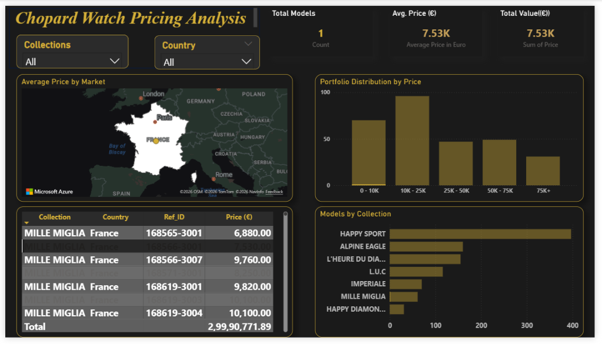

# Chopard Watch Pricing Analysis (Portfolio Project)

Hey! This is a project where I took a deep dive into how Chopard prices their luxury watches across different parts of the world. Luxury brands usually have different pricing strategies for different regions, and I wanted to see exactly how that looks for a brand like Chopard.



## What's the point of this?

I analyzed pricing data for about 990 watches across 5 major regions: Switzerland (home of Chopard), USA, UK, Japan, and the EU. The main goal was to answer a few simple questions:
- Are luxury watches actually cheaper in Europe?
- Which collections are the most expensive? (Spoiler: It's L'Heure du Diamant)
- How messy is the data when it comes straight from the source?

## Key Things I Found

- **990 watches** made it through my cleaning process.
- **Price range** is huge: from €3,750 all the way up to €110,000 for the high-end pieces.
- **Average price** sits around €30,294, but there are plenty of "entry-level" (for luxury) Happy Sport watches around €15k.
- **Regional differences** are definitely there—suggesting that brand positioning changes depending on where you are.

## How I Built It (The Pipeline)

The data was actually pretty messy. BigQuery had it stored in a weird semicolon-delimited format in a single column, so I had to get creative with `StringIO` to parse it properly. 

1. **Extract**: I built it to toggle between local Excel files and live BigQuery data.
2. **Transform**: 
   - Cleaned out the 'NULL' strings and weird duplicates.
   - Used a live API (exchangerate-api.com) to get fresh EUR rates so comparisons are fair.
   - Standardized the collection names (found a lot of extra quotes and spaces).
3. **Load**: The final cleaned data goes into a CSV and back into BigQuery for visualization.

```bash
# To run the whole thing:
python scripts/run_pipeline.py --bigquery
```

## Project Structure

I tried to keep it organized like a real-world data engineering project:
- `/src/chopard/`: All the core logic (Ingestion, Processing, Exchange Rates).
- `/scripts/`: One-click runners for the pipeline and EDA.
- `/notebooks/`: Where I did the initial messy exploration and charting.
- `/data/`: Where the final cleaned results and charts live.

## Tech Stack

- **Python & Pandas**: For all the heavy lifting and data cleaning.
- **BigQuery**: Used this as the "Source of Truth" warehouse.
- **Matplotlib/Seaborn**: For those quick EDA charts to spot outliers.
- **Power BI**: Working on a dash right now to make it look premium.

## How to set it up

1. Clone it: `git clone <repo-url>`
2. Install the requirements: `pip install -r requirements.txt`
3. Set up your `.env` with your GCP project details:
```
GCP_PROJECT_ID=your-project-id
BIGQUERY_DATASET_ID=your-dataset
```
4. Run it: `python scripts/run_pipeline.py`

## About the Author

This project is part of my portfolio to show how I handle end-to-end data pipelines—from dealing with messy raw data to calculating live currency conversions and prepping it for a business dashboard.

---
*MIT License - feel free to fork it or use it as a reference for your own projects!*
